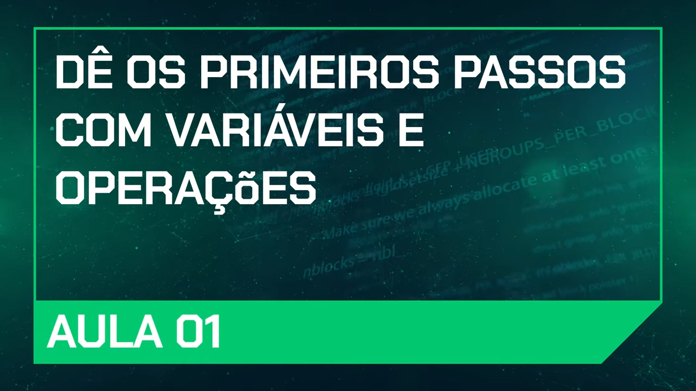

# Comece a Programar Usando Variáveis e Operações 

## Nesta aula, vamos criar um conversor de Won para Real e Dólar, utilizando lógica de programação e explorando conceitos fundamentais de JavaScript.

## 